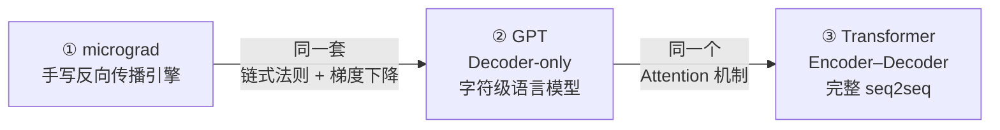

<div align="center">

# 🧠 Deep-Learning · 三大经典,逐模块从零手写

**反向传播引擎 → 字符级 GPT → 原版 Transformer (seq2seq)**
不依赖任何高层封装，一条学习链路到底；每一行代码都写了"为什么这样设计"的中文注释。

`纯 Python` · `PyTorch` · `From Scratch` · `Autograd` · `Transformer` · `GPT`

</div>

---

## 📌 仓库简介

这是一个**刻意不用现成框架封装、把深度学习核心组件亲手重写一遍**的学习仓库。用三个递进的项目，覆盖了深度学习从"最底层的求导"到"最完整的 Seq2Seq 架构"：

| 层级 | 项目 | 你要亲手写出来的东西 |
|------|------|---------------------|
| ① 最底层 | `micrograd.ipynb` | 一个微型 **自动求导引擎**（反向传播 / 链式法则） |
| ② 解码端 | `gpt.ipynb` | 一个约 **10.8M 参数的字符级 GPT**（Decoder-only） |
| ③ 编解码 | `transformer_ZeroToDone.ipynb` | 原版 **《Attention Is All You Need》Encoder-Decoder** |

与"调包"式学习最大的不同：**这里没有 `nn.Transformer`，没有现成训练器，所有矩阵流向和梯度规则都是自己写出来的。** 写好之后再回头看任何框架，它们内部在做什么就一目了然。

---

## 🗺 内容导览

| 文件 | 一句话定位 | 参考来源 |
|------|-----------|----------|
| `micrograd.ipynb` | 用纯 Python 手写反向传播引擎（约 150 行一个 `Value` 类搞定） | [micrograd](https://github.com/karpathy/micrograd) · Andrej Karpathy |
| `gpt.ipynb` | 从零搭建字符级 GPT 语言模型并训练到能"写"出莎翁体文字 | [Let's build GPT](https://www.youtube.com/watch?v=kCc8FmEb1nY) / [nanoGPT](https://github.com/karpathy/nanoGPT) · Andrej Karpathy |
| `transformer_ZeroToDone.ipynb` | 复现 2017 原版 Transformer，完整实现 Encoder-Decoder 与训练闭环 | [Attention Is All You Need](https://arxiv.org/abs/1706.03762) 论文 |
| `input.txt` | GPT 的训练语料（Tiny Shakespeare，约 1.1 MB） | nanoGPT 官方数据 |

> 三个项目的代码都带有**逐行中文注释**，不只写"这行做什么"，更写"为什么这么设计、换一种写法会出什么问题"——本仓库的核心价值也在这里。

---

## 🧭 学习路径（为什么是这三样）



1. **先搞懂梯度从哪来** —— `micrograd` 用最少的代码把"反向传播 = 计算图 + 拓扑序 + 链式法则"彻底讲透；
2. **再看注意力怎么搭建** —— `GPT` 是"只有 Decoder"的最简 Transformer 应用：词表 → 自注意力 → 下一个字符；
3. **最后补全整个架构** —— `Transformer` 加上 Encoder、Cross-Attention、掩码、标签平滑与学习率调度，凑成完整的 Seq2Seq。

每一步都向下兼容前一步的理解，代码量也逐级放大，是一份完整的"由点到面"学习曲线。

---

## ⚙️ 运行环境与快速开始

**依赖**：Python 3.8+、PyTorch 2.0+、Jupyter。有 NVIDIA GPU 会自动使用（代码里 `device` 自动选择），没有 GPU 也能在 CPU 上跑通（只是慢些）。

```bash
# 1. 安装依赖（有 GPU 建议按官网安装对应 CUDA 版 torch）
pip install -r requirements.txt

# 2. 方式一：命令行直接跑通并保存运行结果
jupyter nbconvert --to notebook --execute --inplace micrograd.ipynb
jupyter nbconvert --to notebook --execute --inplace gpt.ipynb        # 需与 input.txt 同目录

# 3. 方式二：Jupyter / VS Code 打开 notebook → Run All
```

| Notebook | 可运行性 | 备注 |
|----------|---------|------|
| `micrograd.ipynb` | ✅ 任意环境可跑 | **只依赖 Python 标准库**，无需安装 torch |
| `gpt.ipynb` | ✅ 开箱即跑 | 会自动读取同目录 `input.txt`；GPU/CPU 均可 |
| `transformer_ZeroToDone.ipynb` | ✅ 开箱即跑 | 自带轻量自测任务，数分钟可跑完 |

想调整模型规模：直接改 notebook 顶部的**全局超参数区**即可。

---

## ① micrograd —— 用纯 Python 手写反向传播

> `micrograd.ipynb` · 参考 [Andrej Karpathy 的 micrograd](https://github.com/karpathy/micrograd)

### 实现了什么

深度学习三大库（PyTorch / TensorFlow）的自动求导，本质就是这一件事：**把每个运算记进一张计算图，再用链式法则从 loss 一路把梯度传回去。** 本项目只用**标准库**完整复刻了这件事：

- **`Value` 类**：同时记录数值 `data`、梯度 `grad`、父节点 `_prev` 和运算类型 `_op`，一个对象就是一个计算图节点；
- **运算符重载**：`+ − × ÷ ** `、`relu`、`tanh`，以及配套的 `__radd__ / __rsub__ / __rmul__ / __rtruediv__`（保证 `2 + a`、`a / 2` 这类"数字在左"的写法也能工作）；
- **`backward()`**：用 **DFS 拓扑排序**保证"一个节点的梯度算完前，它依赖的所有子节点梯度都先算好"，再倒序执行链式法则。

```python
# 只用了 3 类"零件"——建图、记 backward、拓扑序回放
a = Value(2.0); b = Value(-3.0)
c = a * b + 5.0          # 每次运算都自动挂上该运算的 _backward
loss = c.relu() ** 2
loss.backward()          # 一键拿到所有参数梯度
print(a.grad)            # d loss / d a
```

### 我的额外工作（相对参考实现）

- 补全了 `tanh`、除法与"数字在左"的整套反向算子，并对每个算子的梯度推导写明了注释；
- 原版附带的"神经网络训练"演示未照搬，而是写了一个**手算对答案的验证 demo**：构造单神经元 → 前向 → 反向 → 用解析梯度核对 → 手动执行一步梯度下降，完整展示"梯度是被正确算出来的"。

---

## ② GPT —— 从零搭建并训练一个字符级语言模型

> `gpt.ipynb` · 参考 Karpathy [Let's build GPT](https://www.youtube.com/watch?v=kCc8FmEb1nY)（Zero to Hero 系列）与 [nanoGPT](https://github.com/karpathy/nanoGPT)

### 实现了什么

不调用任何现成注意力层，**自底向上**手写了一个完整的 Decoder-only Transformer：

```
Head(单头因果自注意力)          # key/query/value 线性投影 + 缩放点积 + 因果掩码 + softmax
   └─ MultiHeadAttention        # n 头并行 + 线性融合(proj) + dropout
        └─ Block                # Pre-LN + 多头注意力 + 前馈网络 + 残差连接（堆 6 层）
             └─ GPTLanguageModel  # token/位置双嵌入 → N×Block → LayerNorm → 打分头
```

配套手写了：字符级分词器（`stoi/itos` 双向词表）、`get_batch` 随机切批、`estimate_loss` 无梯度评估、参数初始化、采样生成 `generate`。

**超参数**（notebook 顶部可改）

| 项 | 值 | 项 | 值 |
|----|----|----|----|
| 模型层数 `n_layer` | 6 | 注意力头 `n_head` | 6 |
| 嵌入维度 `n_embd` | 384 | 上下文 `block_size` | 256 |
| 参数量 | **≈ 10.79 M** | dropout | 0.2 |
| 优化器 | AdamW, lr 3e-4 | 训练步数 | 3000 |

**训练曲线**（真实运行输出，train/val 划分 9:1）

| step | train loss | val loss |
|------|-----------|----------|
| 0 | 4.2221 | 4.2306 |
| 1000 | 1.3913 | 1.6010 |
| 2000 | 1.1891 | 1.5078 |
| 2999 | **1.0702** | **1.4839** |

**生成效果**（温度 0.7 + top-k=10 采样，莎士比亚语料微风格）：

> And fit our coate to the moise of his crown.  
> KING RICHARD II: And happin him! the days not to Rapose,  
> To defend the foul of summer's heart. …

### 我的额外工作（相对教程原版）

- 在采样端**自主增加了 `temperature` 与 `top-k` 两个可控参数**（原版仅做原始采样）——用注释讲清了它们在"文本连贯性 vs 多样性"上的权衡；
- 全程补充了大量"为什么"注释：因果掩码如何做到"未来不可见"、`register_buffer` 与可学习参数的区别、Pre-LN 为何能缓解梯度消失、`logits` 为何要拉平成 `B×T` 再算交叉熵、`multinomial` 采样为何比 `argmax` 更有"创造力"。

---

## ③ Transformer —— 复现《Attention Is All You Need》

> `transformer_ZeroToDone.ipynb` · 论文 [Attention Is All You Need (Vaswani et al., 2017)](https://arxiv.org/abs/1706.03762)，教学注释参考《动手学深度学习》(李沐) 一脉的讲解

### 实现了什么

**从零逐模块拼出完整 Seq2Seq Transformer**，一个 `nn.Transformer` 都没用：

| 模块 | 说明 |
|------|------|
| `MultiHeadAttention` | 多头自/交叉注意力（4 个投影矩阵 + 返回注意力权重便于可视化） |
| `PositionalEncoding` | 正弦位置编码，`register_buffer` 注册 |
| `LayerNorm` + `SublayerConnection` | Pre-LN：先归一化再进子层，外层恒等残差 |
| `EncoderLayer / DecoderLayer` | 自注意力 · 交叉注意力 · 前馈网络 三层堆叠 |
| `Batch / mask` | padding 掩码 + 因果掩码组合，训练数据错位打包 |
| `LabelSmoothing` | 标签平滑（KL 散度 + 忽略 pad），缓解模型过度自信 |
| `Noam scheduler` | 学习率"先热身后衰减"，按模型维度自适应 |
| `make_model` | 工厂函数一键装配 + Xavier 初始化 |
| `greedy_decode` | 自回归式贪心解码（推理闭环） |

**数据流向**：

```
src → Embedding×√d_model → Encoder(N×) ──memory──▶ Decoder(N×) → Linear+LogSoftmax → loss/生成
                        (Pad mask)        (src_mask)  (Masked Self-Attn + Cross-Attn + FFN)
                                                        (Pad mask & 因果 mask)
```

**验证 demo（真实运行结果）**——一个"复述数字"的 copy 任务：模型要在 Encoder-Decoder 下把一串输入原样输出。训练 20 轮后，贪心解码结果与输入**逐位完全一致**，证明"编码 → 记忆 → 自回归解码"的**训练与推理闭环全部正确**：

```text
输入 src = [1, 2, 3, 4, 5, 6, 7, 8, 9, 10]
解码输出 = [1, 2, 3, 4, 5, 6, 7, 8, 9, 10]   ✅ 完全复述
```

### 我的额外工作（相对参考实现）

- 逐层手写并注释了 **`Embeddings × √d_model`**（防止词向量被位置编码淹没）、**LabelSmoothing 用 `reduction="sum"`**（避免 pad 摊薄平均损失）等容易被人忽视的工程细节；
- 采用 **Pre-LN 残差结构**并说明其相比 Post-LN 训练更稳定的原因；
- 用最小规模的 copy 任务把"训练 + 评估 + 推理"全链路一次性验证跑通。

---

## 💡 几个"值得细品"的设计细节

本仓库注释里散落了很多这类思考，这里挑几条汇总（也是我个人理解最深的部分）：

1. **自动求导为什么能工作**——反向传播 = 计算图 + 拓扑序 + 链式法则；同一变量被多条路径用时梯度要 `+=`（各路之和），而不是 `=`（micrograd）。
2. **Embedding 为什么要乘 `√d_model`**——词向量数值很小，不放大则相加后被位置编码"淹没"（Transformer）。
3. **为什么全用 Pre-LN 而不是 Post-LN**——先归一化、再进子层，残差主干道始终是"恒等加法"，深层训练更稳，不易梯度消失/爆炸（GPT 与 Transformer 均如此）。
4. **因果掩码怎么做到"只见过去"**——下三角布尔掩码 + `masked_fill(-inf)`，softmax 之后未来位置概率归零（GPT）。
5. **`temperature`/`top-k` 采样的取舍**——压低长尾、抬高头部，让模型在"连贯"与"有创造性"之间可调（GPT，自主改进）。
6. **标签平滑与 Noam 调度为何配套出现**——一个防"过度自信"，一个按模型维度给合理基准学习率，共同服务于稳定的收敛（Transformer）。
7. **`register_buffer` vs `Parameter`**——掩码、位置编码"要随模型迁移保存但不可被梯度更新"，所以注册为 buffer 而非参数（两个项目都有体现）。

---

## 📦 目录结构

```
Deep-Learning/
├── README.md                        # 本说明
├── LICENSE                          # MIT License
├── requirements.txt                 # 运行依赖
├── .gitignore
├── .gitattributes
├── input.txt                        # GPT 训练语料（Tiny Shakespeare，~1.1MB）
├── micrograd.ipynb                  # ① 纯 Python 手写自动求导引擎
├── gpt.ipynb                        # ② 字符级 GPT（~10.8M 参数）
└── transformer_ZeroToDone.ipynb     # ③ 原版 Transformer（Encoder-Decoder）
```

---

## 📚 参考与致谢

本项目为个人学习复现，代码与下述 MIT 开源教程/论文同源，感谢开源社区：

- **论文**：《[Attention Is All You Need](https://arxiv.org/abs/1706.03762)》, Vaswani et al., 2017
- **Andrej Karpathy**：[micrograd](https://github.com/karpathy/micrograd) · [Let's build GPT（Zero to Hero 视频）](https://www.youtube.com/watch?v=kCc8FmEb1nY) · [nanoGPT（含 Tiny Shakespeare 语料）](https://github.com/karpathy/nanoGPT)
- **《动手学深度学习》**（李沐等）：[d2l-zh](https://zh.d2l.ai/)
- **The Annotated Transformer**（Harvard NLP）：[nlp.seas.harvard.edu/annotated-transformer](https://nlp.seas.harvard.edu/annotated-transformer/)

---

## 📄 License

[MIT](./LICENSE) © 2026

---

*从"梯度怎么算"一路手写到"机器怎么翻译"，这个仓库记录了我对深度学习从入门到入微的过程。欢迎 Star / Issue 交流。*
